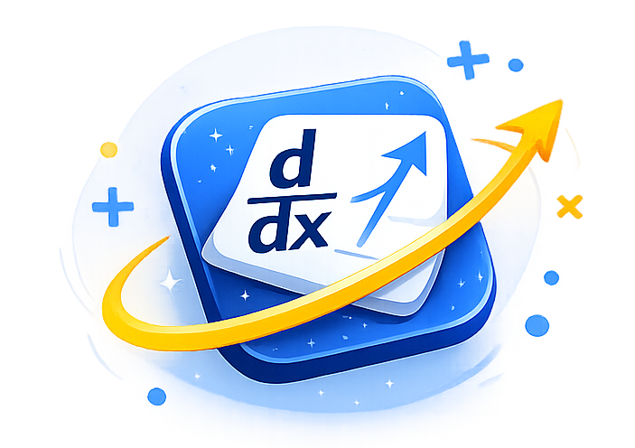

# Derivative Damath

<p align="center">
  
</p>

Derivative Damath is a Flutter-based educational board game that combines the traditional Filipino board game "Damath" with calculus derivatives. Players learn mathematical concepts while competing in an engaging strategy game.

## 🎮 Game Features

- **Two Game Modes**: Play against the computer (PvC) or compete with a friend in local multiplayer (PvP)
- **Timer Option**: Choose to play with or without a 2-minute turn timer
- **Derivative Mechanics**: Each chip contains a polynomial - compute its derivative after every move to score points
- **Smart Capture System**: Jump over opponent chips to capture them and chain multiple captures in one turn
- **Dama Promotion**: Reach the opposite end of the board to promote your chip to "Dama" (King), gaining enhanced movement abilities
- **Sound Effects**: Immersive audio feedback for game events

## 📱 Screenshots

The app features a modern, clean interface with:
- Home screen with game mode selection
- Interactive 8x8 game board
- Real-time score tracking
- Move history viewer
- Comprehensive "How to Play" guide

## 🏃 How to Play

### Objective
Capture opponent's chips by landing on their tile while computing derivatives of your polynomial chips. Apply the operation on the tile you land on and score points based on correct computation. Win by capturing all opponent chips or having the highest score.

### Movement Rules
- **Regular Chips**: Move diagonally forward only (one step)
- **Dama (King) Chips**: Can move diagonally in any direction (forward & backward) and multiple tiles

### Capture Rules
- Jump diagonally over opponent's chip to capture
- Land on the empty tile directly behind the opponent
- Chain captures are allowed (multiple captures in one turn)

### Must Capture Rule
If any of your chips can capture, you MUST capture. Regular moves are not allowed when capture is available.

### Scoring
- Compute the derivative of your chip's polynomial
- Apply the operation on the tile you landed on (+, −, ×, ÷)
- Evaluate at x = |x_coord - y_coord| (values: 1, 3, 5, or 7)
- Dama multipliers: 2x for one Dama, 4x for both

### Timer
- 2 minutes per turn
- Timeout deducts 10,000 points!

## 🚀 Getting Started

### Prerequisites

- Flutter SDK 3.9.2 or higher
- Dart SDK 3.9.2 or higher

### Installation

1. Clone the repository:
   ```bash
   git clone <repository-url>
   cd derivative-damath
   ```

2. Install dependencies:
   ```bash
   flutter pub get
   ```

3. Run the app:
   ```bash
   flutter run
   ```

### Build for Release

```bash
# Android
flutter build apk --release

# iOS
flutter build ios --release

# Web
flutter build web
```

## 🛠️ Tech Stack

- **Framework**: Flutter 3.9.2
- **State Management**: Riverpod
- **Math Engine**: math_expressions
- **Audio**: audioplayers
- **Architecture**: Clean Architecture with separation of concerns

## 📂 Project Structure

```
lib/
├── main.dart                 # App entry point
├── models/                   # Data models
│   ├── chip_model.dart       # Chip (piece) data
│   ├── game_state_model.dart # Game state management
│   ├── move_history_model.dart
│   ├── operation_model.dart  # Mathematical operations
│   ├── player_model.dart     # Player data
│   └── tile_model.dart      # Board tile data
├── screens/                  # App screens
│   ├── game_screen.dart     # Main game board
│   ├── home_screen.dart     # Home menu
│   └── how_to_play_screen.dart
├── utils/                    # Utilities
│   ├── ai_opponent.dart     # Computer AI logic
│   ├── derivative_rules.dart # Derivative computations
│   ├── game_logic.dart      # Core game mechanics
│   ├── initial_positions.dart
│   ├── operations_layout.dart
│   ├── score_calculator.dart
│   └── sound_service.dart   # Audio management
└── widgets/                 # Reusable UI components
    ├── chip_widget.dart
    ├── custom_button.dart
    ├── draggable_piece.dart
    ├── game_board.dart
    ├── move_history_modal.dart
    ├── player_info_card.dart
    ├── score_board.dart
    └── tile_widget.dart
```

## 📝 Basic Derivative Rules

| Formula | Example |
|---------|---------|
| d/dx(xⁿ) = n·xⁿ⁻¹ | d/dx(x³) = 3x² |
| d/dx(c) = 0 | d/dx(5) = 0 |
| d/dx(cx) = c | d/dx(4x) = 4 |

## 📄 License

This project is for educational purposes.

## 🙏 Acknowledgments

- Traditional Damath game concept
- Flutter framework and community
